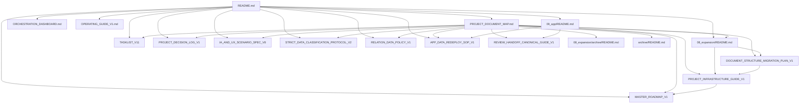

# Markdown Document Relation Mindmap V1

> Purpose: 프로젝트 내 모든 `*.md` 문서의 연결관계를 전수 점검하고, 현재 구조 변경이 입구 문서와 하위 연결 문서에 미치는 영향이 없는지 검증하기 위한 기준 문서
>
> Validation Date: `2026-03-14`
> Scope: `node_modules`, `dist` 제외 전체 Markdown 문서

## 1. Validation Summary

- 총 Markdown 문서 수: `99`
- local markdown-to-markdown 링크 수: `74`
- 1차 검출 broken link: `5`
- 조치 후 broken link: `0`

검증 결과:

- 현재 입구 문서(`README.md`, `PROJECT_DOCUMENT_MAP.md`, `08_expansion/PROJECT_INFRASTRUCTURE_GUIDE_V1.md`, `08_expansion/DOCUMENT_STRUCTURE_MIGRATION_PLAN_V1.md`, `08_expansion/README.md`, `09_app/README.md`) 기준 1단계, 2단계, 3단계 연결에서 누락 링크 없음
- 개발 에이전트의 runtime/deploy 경로(`09_app/README.md`, `09_app/public/data/README.md`, `08_expansion/APP_DATA_REDEPLOY_SOP_V1.md`, `08_expansion/REVIEW_HANDOFF_CANONICAL_GUIDE_V1.md`) 무결성 확인
- 운영 프로토콜 문서(`WORKBOARD_TEMPLATE_V1.md`, `workboard_archive/README.md`) 추가 후에도 입구 문서 연결 무결성 유지
- archive/history 문서의 stale link 5건은 현재 canonical 또는 현재 경로 기준으로 정리함

## 2. 3인 전문가 검토 요약

### 정보구조 전문가

- 입구 문서에서 2단계 문서로 내려가는 경로가 현재는 `README -> PROJECT_DOCUMENT_MAP -> 08_expansion/README / ORCHESTRATION_DASHBOARD`로 안정화됨
- `APP_DATA_REDEPLOY_SOP_V1.md`의 primary 위치를 `앱 런타임 및 배포` 섹션으로 정리한 점이 유효

### 운영 문서 전문가

- legacy 허브의 stale SSOT 목록 제거 후, 현재 운영 SSOT 순서가 명확해짐
- top-level `archive/` 문서는 history-only로 해석되며 현재 운영 경로를 오염시키지 않음

### 개발/배포 전문가

- 개발 에이전트가 실제로 읽어야 할 경로는 변경되지 않았고, 모두 유효함
- runtime canonical은 계속 `09_app/public/data/live/` 기준으로 유지됨

## 3. 입구 문서 마인드맵

## 4. 1단계 / 2단계 / 3단계 연결 결과

현재 입구 문서 기준 연결 집합은 1단계, 2단계, 3단계 모두 동일한 stable core로 수렴한다.

핵심 연결 문서:

- `.gemini-orchestration/ORCHESTRATION_DASHBOARD.md`
- `.gemini-orchestration/OPERATING_GUIDE_V1.md`
- `.gemini-orchestration/PLANNING_AGENT_WORKBOARD_V1.md`
- `.gemini-orchestration/DATA_VALIDATION_AGENT_WORKBOARD_V1.md`
- `.gemini-orchestration/DEVELOPMENT_AGENT_WORKBOARD_V1.md`
- `.gemini-orchestration/REVIEW_AGENT_WORKBOARD_V1.md`
- `README.md`
- `PROJECT_DOCUMENT_MAP.md`
- `08_expansion/README.md`
- `08_expansion/MASTER_ROADMAP_V1.md`
- `08_expansion/SOURCE_RICH_IMPLEMENTATION_TASKLIST_V11.md`
- `08_expansion/PROJECT_DECISION_LOG_V1.md`
- `08_expansion/PROJECT_INFRASTRUCTURE_GUIDE_V1.md`
- `08_expansion/DOCUMENT_STRUCTURE_MIGRATION_PLAN_V1.md`
- `08_expansion/STRICT_DATA_CLASSIFICATION_PROTOCOL_V2.md`
- `08_expansion/RELATION_DATA_POLICY_V1.md`
- `08_expansion/APP_DATA_REDEPLOY_SOP_V1.md`
- `08_expansion/REVIEW_HANDOFF_CANONICAL_GUIDE_V1.md`
- `08_expansion/VOCAB_LEVEL_BAND_DEFINITION_V3.md`
- `08_expansion/XWD_DISCOVERY_FRAMEWORK_V1.md`
- `09_app/README.md`
- `09_app/public/data/README.md`
- `08_expansion/archive/README.md`
- `archive/README.md`

의미:

- 구조 변화 이후에도 입구 문서에서 내려가는 active 문서 그래프가 흔들리지 않고 닫혀 있다.
- 2단계, 3단계에서 새로 unexpected canonical 문서가 튀어나오지 않는다.

## 5. 현재 outgoing link를 가진 Markdown 문서

링크를 실제로 내보내는 문서는 아래가 핵심이다.

- `README.md`
- `PROJECT_DOCUMENT_MAP.md`
- `.gemini-orchestration/ORCHESTRATION_DASHBOARD.md`
- `08_expansion/MASTER_ROADMAP_V1.md`
- `08_expansion/PROJECT_INFRASTRUCTURE_GUIDE_V1.md`
- `08_expansion/SOURCE_RICH_IMPLEMENTATION_TASKLIST_V11.md`
- `.gemini-orchestration/codex skills/multi-agent-orchestration/SKILL.md`
- `archive/NEXT_THREAD_HANDOFF_V4.md`
- `archive/NEXT_THREAD_HANDOFF_V5.md`

그 외 다수 문서는 leaf document이며, 참조는 받지만 다른 로컬 markdown 문서로 직접 링크하지 않는다.

### Full Outgoing Relation Inventory

#### `README.md`
- `PROJECT_DOCUMENT_MAP.md`
- `.gemini-orchestration/ORCHESTRATION_DASHBOARD.md`
- `.gemini-orchestration/OPERATING_GUIDE_V1.md`
- `08_expansion/SOURCE_RICH_IMPLEMENTATION_TASKLIST_V11.md`
- `08_expansion/MASTER_ROADMAP_V1.md`
- `08_expansion/PROJECT_DECISION_LOG_V1.md`
- `08_expansion/IA_AND_UX_SCENARIO_SPEC_V8.md`
- `08_expansion/STRICT_DATA_CLASSIFICATION_PROTOCOL_V2.md`
- `08_expansion/RELATION_DATA_POLICY_V1.md`
- `08_expansion/APP_DATA_REDEPLOY_SOP_V1.md`
- `08_expansion/PROJECT_INFRASTRUCTURE_GUIDE_V1.md`
- `08_expansion/DOCUMENT_STRUCTURE_MIGRATION_PLAN_V1.md`
- `08_expansion/README.md`
- `08_expansion/MARKDOWN_DOCUMENT_RELATION_MINDMAP_V1.md`
- `09_app/README.md`

#### `PROJECT_DOCUMENT_MAP.md`
- `README.md`
- `.gemini-orchestration/ORCHESTRATION_DASHBOARD.md`
- `.gemini-orchestration/OPERATING_GUIDE_V1.md`
- `.gemini-orchestration/PLANNING_AGENT_WORKBOARD_V1.md`
- `.gemini-orchestration/DATA_VALIDATION_AGENT_WORKBOARD_V1.md`
- `.gemini-orchestration/REVIEW_AGENT_WORKBOARD_V1.md`
- `.gemini-orchestration/DEVELOPMENT_AGENT_WORKBOARD_V1.md`
- `08_expansion/README.md`
- `08_expansion/MASTER_ROADMAP_V1.md`
- `08_expansion/SOURCE_RICH_IMPLEMENTATION_TASKLIST_V11.md`
- `08_expansion/PROJECT_DECISION_LOG_V1.md`
- `08_expansion/IA_AND_UX_SCENARIO_SPEC_V8.md`
- `08_expansion/PROJECT_INFRASTRUCTURE_GUIDE_V1.md`
- `08_expansion/DOCUMENT_STRUCTURE_MIGRATION_PLAN_V1.md`
- `08_expansion/MARKDOWN_DOCUMENT_RELATION_MINDMAP_V1.md`
- `09_app/README.md`
- `09_app/public/data/README.md`
- `08_expansion/APP_DATA_REDEPLOY_SOP_V1.md`
- `08_expansion/REVIEW_HANDOFF_CANONICAL_GUIDE_V1.md`
- `08_expansion/STRICT_DATA_CLASSIFICATION_PROTOCOL_V2.md`
- `08_expansion/RELATION_DATA_POLICY_V1.md`
- `08_expansion/VOCAB_LEVEL_BAND_DEFINITION_V3.md`
- `08_expansion/XWD_DISCOVERY_FRAMEWORK_V1.md`
- `08_expansion/archive/README.md`
- `archive/README.md`

#### `.gemini-orchestration/ORCHESTRATION_DASHBOARD.md`
- `.gemini-orchestration/OPERATING_GUIDE_V1.md`
- `.gemini-orchestration/PLANNING_AGENT_WORKBOARD_V1.md`
- `.gemini-orchestration/DATA_VALIDATION_AGENT_WORKBOARD_V1.md`
- `.gemini-orchestration/REVIEW_AGENT_WORKBOARD_V1.md`
- `.gemini-orchestration/DEVELOPMENT_AGENT_WORKBOARD_V1.md`
- `08_expansion/MASTER_ROADMAP_V1.md`
- `08_expansion/PROJECT_INFRASTRUCTURE_GUIDE_V1.md`
- `08_expansion/SOURCE_RICH_IMPLEMENTATION_TASKLIST_V11.md`
- `PROJECT_DOCUMENT_MAP.md`

#### `08_expansion/MASTER_ROADMAP_V1.md`
- `.gemini-orchestration/OPERATING_GUIDE_V1.md`
- `08_expansion/SOURCE_RICH_IMPLEMENTATION_TASKLIST_V11.md`

#### `08_expansion/SOURCE_RICH_IMPLEMENTATION_TASKLIST_V11.md`
- `08_expansion/PROJECT_DECISION_LOG_V1.md`

#### `08_expansion/PROJECT_INFRASTRUCTURE_GUIDE_V1.md`
- `README.md`
- `08_expansion/MASTER_ROADMAP_V1.md`

#### `.gemini-orchestration/codex skills/multi-agent-orchestration/SKILL.md`
- `.gemini-orchestration/codex skills/multi-agent-orchestration/references/document-layout.md`
- `.gemini-orchestration/codex skills/multi-agent-orchestration/references/expert-review-notes.md`
- `.gemini-orchestration/codex skills/multi-agent-orchestration/references/instruction-patterns.md`
- `.gemini-orchestration/codex skills/multi-agent-orchestration/references/placement-rationale.md`

#### `archive/NEXT_THREAD_HANDOFF_V4.md`
- `.gemini-orchestration/OPERATING_GUIDE_V1.md`
- `08_expansion/PROJECT_DECISION_LOG_V1.md`
- `08_expansion/SOURCE_RICH_IMPLEMENTATION_TASKLIST_V11.md`

#### `archive/NEXT_THREAD_HANDOFF_V5.md`
- `PROJECT_DOCUMENT_MAP.md`
- `08_expansion/PROJECT_INFRASTRUCTURE_GUIDE_V1.md`
- `08_expansion/SOURCE_RICH_IMPLEMENTATION_TASKLIST_V11.md`

## 6. 수정한 broken link 조치 내역

### archive/history 문서

- `08_expansion/archive/historical_docs/STRUCTURAL_INTEGRITY_REMEDIATION_V1.md`
  - missing `TASKLIST_V9`, `IA_V8` 링크 정리
- `archive/NEXT_THREAD_HANDOFF_V3.md`
  - `.codex-orchestration` legacy 경로를 `.gemini-orchestration` 기준으로 정리
- `archive/NEXT_THREAD_HANDOFF_V4.md`
  - missing `TASKLIST_V5`를 현재 canonical `TASKLIST_V11` 안내로 정리
- `archive/NEXT_THREAD_HANDOFF_V5.md`
  - missing `TASKLIST_V10`를 현재 canonical `TASKLIST_V11` 안내로 정리

## 7. 입구 문서 재검토 결과

다음 입구 문서들이 현재 구조 변화를 올바르게 반영하고 있는지 재검토했다.

- `README.md`
- `PROJECT_DOCUMENT_MAP.md`
- `08_expansion/PROJECT_INFRASTRUCTURE_GUIDE_V1.md`
- `08_expansion/DOCUMENT_STRUCTURE_MIGRATION_PLAN_V1.md`
- `08_expansion/README.md`
- `09_app/README.md`

결론:

- 모두 존재하며 링크가 유효함
- 개발 에이전트용 runtime/deploy 동선은 유지됨
- archive 구역과 active canonical 구역의 구분이 입구 문서에 반영됨

## 8. Residual Risk

- legacy orchestration hub는 `.gemini-orchestration/archive/WORK_ORCHESTRATION_HUB_RESTART_LEGACY_V1.md`로 분리되었고, live 폴더에는 slim current hub만 남았다.
- 현재 남은 리스크는 archive/history 문서가 여전히 많아, 장기적으로는 `legacy handoff`와 `legacy snapshot`의 세분 구역을 더 나누면 좋다는 점이다.
